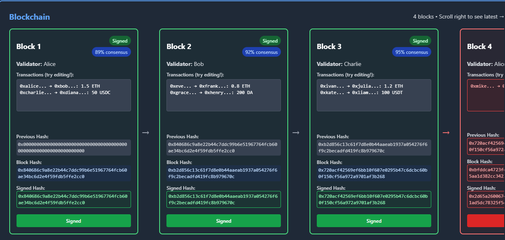
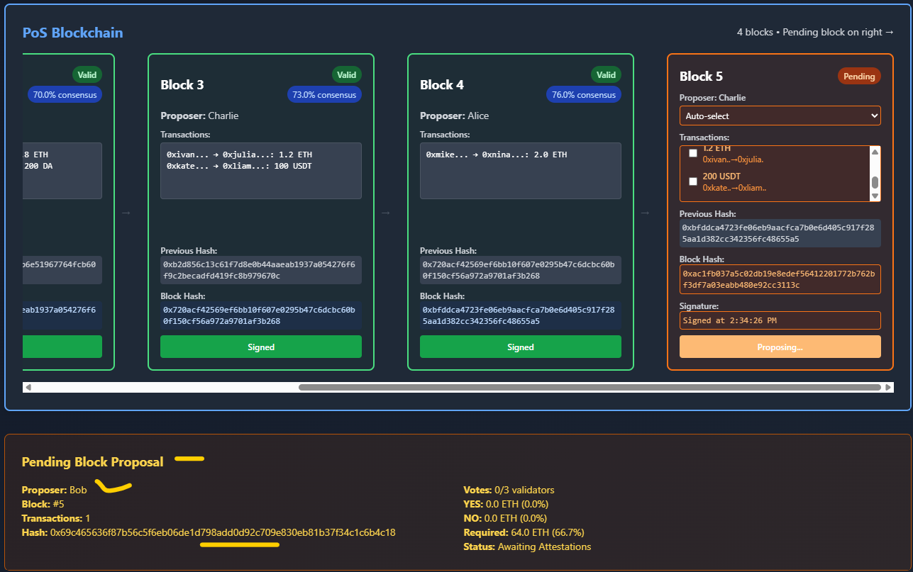
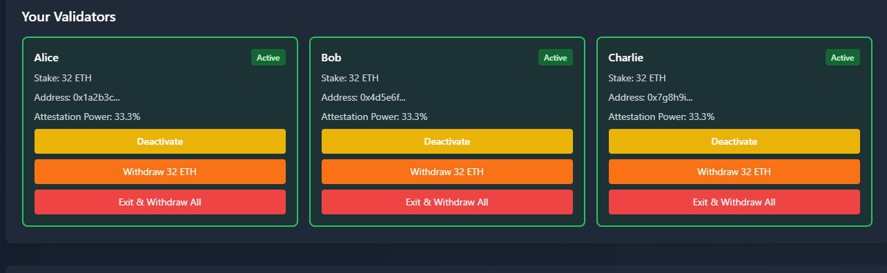
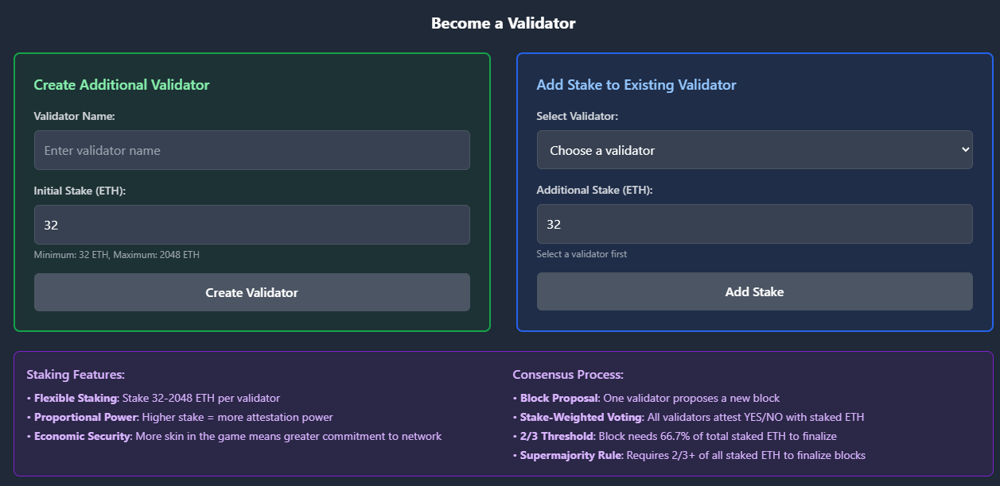

### Blockchain Architecture Overview

- Consesus problem - come to an an aggreement
- Sybil attacks - many nodes weight or creating psedoanonymous account on to the blockchain
- Sybill Ressistance Mechanism(Pows and Pos )-> stake ETH meight be slashed if the nodes mis behave
- Finality - the txn confirmed by the node can not be reverted unlike bank txn
- After 6 blocks confirm added the probability of reversing it is minimum
- Rewriting all the transaction history consume to much power

### What is Hash and SHA256 algorithm?

- A unique fixed length of string used to identify a piece if data
- Block , nonce , Data and finally Hash for the inserted data
- Bruteforce - miners trying to solve the the nonce number which give the hash number starting with four zeros at the beggining of the hash.
- Genesis block - the first block in the blockchain , mostly it has all the zeros in the hash number .
- Fork - blockchain splits - longest chain rule
- Meme pool - is place where all the transaction lives there before added to the blockchain
- Signature - signing txn with a key
- Cryptographic key -
- Private key - we use to sign txn , like signature stamp
- Public key - its like email address - can verify signature created by our private key and they are linked by math, one way
- our wallet address is linked to our public key or its in short hashed version of it
- in metamask confirm means we are creating digital signature using our private key
- https://demos.updraft.cyfrin.io/ecdsa - use this demo to practice - its all inclusive
- Pows => Miners
  -Pos => Validator stake eth
- Keccak256 Hashing - algo - they are determistic , unique - > one way function

### How Block Hashing Works:

• Block Components: All block data (block number and associated data) is combined

• Deterministic Process: Same block data always produces the same hash

• Avalanche Effect: Changing any data completely changes the hash

• Fixed Output: Hash is always 256 bits (64 hex characters) regardless of input size

• Unique Fingerprint: Each unique block gets a unique hash - no two different blocks can have the same hash

• Next Step: Once hashed, this unique fingerprint can be cryptographically signed by the block proposer

### How Block Signing Works:

• Hash Calculation: Block hash is calculated from all block components (number, previous hash, data, validator, timestamp)

• Signing Process: The validator cryptographically signs the calculated hash

• Verification: Any change to block data changes the hash, invalidating the signature

• Security: This prevents tampering - any modification is immediately detectable

• Ethereum Reality: Real validators sign block hashes using their private keys

### Pos Blockchain

- Any one can become a validator after staking ETH and participating on the network need to have at least 32 ETH and max is 2048 ETH.

- 
- Then validators need to validate based on the proposal
- 
- After all they vote on the proposal and it will go to finality stage. if total 2/3 vote yes then it go to final stage and becomes irrivesable.
- Majority rules!

- POS dont have nounce instead they have signing .

- Validators randomly chosen (Pseudo Rando) algorithm

### Slashing

- If the validators mis consduct and violate consus they will be punished , slashed their portion of stake is called burning (Taken out of circulation) or destroying.

- Validators can vote for punishment - incase double signing blocks , going offline mostly , surround voting - . other can prof this using cryptography for this violation to trigger the slashing mecahnism.

- Every 12 sec(this is called Slots) the validator propose its block and other committe just vote to validate all nned to aggree.
- 32 Slots called Epoch = 6.4 minute or (its means that 12 \* 32 /60)
- justified block is the next block immidiately after the finalized block and then it will be -> final block (finality).
- Game theory - an economic insentive to secure the network while contributing to the network (cheaper than attack) and more benefial than attacking the network.(economic incentive)

### You can become a validator as well

- 

## Blockchain Vulnerabilities - attack

- A critical overview of Understanding Common Blockchain Vulnerabilities - This lesson dissects major blockchain threats, from 51% attacks and MEV to client bugs and replay attacks. Discover why the security of major networks lies not in making attacks impossible, but...

- ## Sybil attack

- same intity pretentds to be multiple intity to gain the majority of the node of the system(creating many multiple node ) inorder to out vote the the rest of the network particapnt (validators). - because they can reverse order history , bouble spend , approve fake txn

- ## 51% Attack

- When they have control of more than 50% of the total staked ETH - they can manipulate the ETH fork algorithm.

- ## Hard Fork -
- When the community comes and takes the new version of the blockchain by spling to new chain - you can read more on ETH documentation

## Blockchain (Re-org)

- When history re- wrtiiten sometimes also called blockchain Reorganization

## MEV (Maximal extractable value) and Sandwich Attacks

- Mem Pool is just waiting room for the txn before confirmation
- EX: a bot can see this pending txn on the mempool and exucute big trade right before you by paying high gas fees(like VIP ticket for instance ) and driving the token price very high and sell it for profit( that is to extract high value profit ) and its legal . Some DEXs have safe guard for this as a matter of protection.

- The person who builds the block can choose the order of the transaction and the bot use MEV attack

## Bugs in the client code

- ### The 184 Billion BTC Bug in 2010 - the community fixed the bug immidiately to 21 Million

- the code written by human
- The client code must be audidted very well

- ## Replay Attacks

- Like photocopying the check or signature and reuse it again on another chain .That is why we add chain-id and nonce to make it sure its unique.

- Summary
- Most of the the attacks in theory it looks possible but in real world its difficult because its take alot to attack than to steal !
- To attack BTC we need Billions woth of Energy and For ETH Billion dollar worth of ETH.
- The system is designed being honest is more profitable than cheating.
