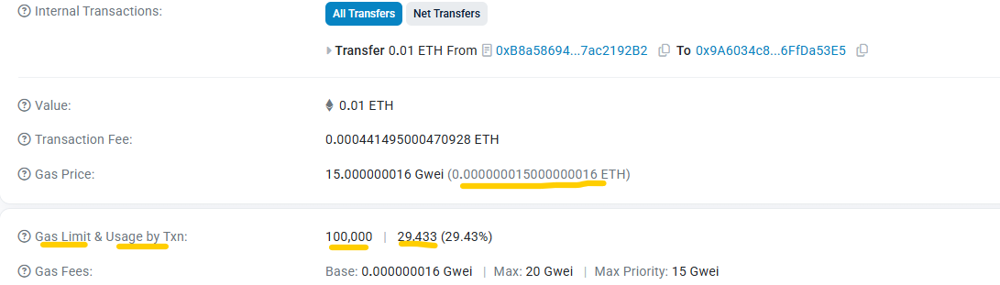

### 🔗 The Problem: A World Built on Centralized Trust

Our modern world runs on intermediaries. We trust banks to manage our money, tech companies to hold our data, and election committees to count our votes. While often efficient, this reliance on a central authority creates significant issues related to control, permission, and trust.

### key summary terms on understanding blockchain

- L1 , L2 - ETH , ARB , ZKsync
- EVM - ERC20
- 51% attack
- Immutable
- Upgradable smart contract

### Wallet

- Metamsk , Seed phrase -> gives access to all the account incase if i lost it
- hot and cold wallet
- Private Key - > gives acces to only one specific account
- Many networks - Eth mainnet , Linea , base mainne etc and many more chains

### Chain ID - all chain has their own chain id for instance ETH is 1.

- Sepolia , linea sepolia --> for testnet

### sending transaction on testnet

- Tenderly testnet(virtual testnet) - add the network prefix inaddition to Eth chain_Id and then we can get test fund from Tinderly
- We can test also sending walet to wallet trasfer between accounts
- tinderly prefix (1)

### Note on testnet - people run the node voluntarly keep in mind

### Introduction to Gas

- Gas is the amount of computational power used to process our transaction.
- Transcation Fee amount paid to process the transaction = gasused \* gas cost per unit(gas price) -

- So when we calculate we get , 0.000441495000470928 as the same as transaction fee mentioned above

- Nodes processes txn and get economic insentive in the form of native token and contribute to security of the network

### What are smart contracts
